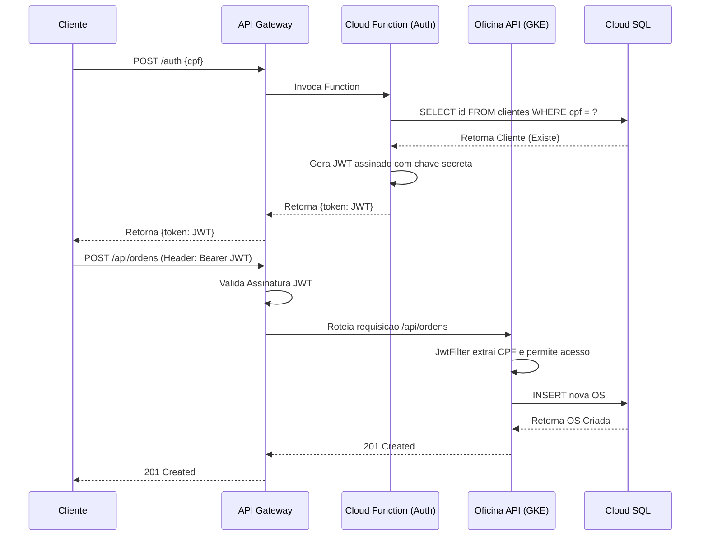
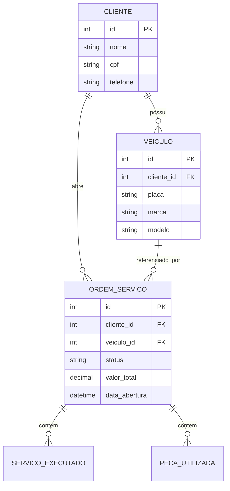

# Documentação da Arquitetura - Fase 03

## 1. Diagrama de Componentes

```mermaid
graph TD
    Client[Cliente] -->|Requisicao| APIGateway[GCP API Gateway]
    
    APIGateway -->|Rota: /auth| CloudFunction[Cloud Function - Auth Serverless]
    APIGateway -->|Rotas: /api/*| GKE[Google Kubernetes Engine]
    
    subcluster GKE
        AppMain[Oficina API App]
        Datadog[Datadog APM Agent]
    end
    
    AppMain --> Datadog
    
    CloudFunction -->|JDBC| CloudSQL[(Cloud SQL PostgreSQL)]
    AppMain -->|JDBC/JPA| CloudSQL
    
    Datadog -->|Métricas e Traces| DatadogConsole[Dashboard Datadog]
```

## 2. Diagrama de Sequência (Autenticação e Abertura de OS)



## 3. RFC: Escolha do Padrão Serverless para Autenticação
**Contexto**: A autenticação anteriormente acoplada ao monolito exigia escalabilidade e alta disponibilidade independente do resto da aplicação, visto que é o gargalo de entrada de todos os usuários.
**Decisão**: Desacoplar o serviço de geração de tokens JWT usando Google Cloud Functions (Serverless).
**Consequências**: 
- A aplicação principal agora atua de forma "stateless/passiva" em relação à autenticação, focando apenas no core business (Domain Driven Design puro).
- O API Gateway valida a camada L7 garantindo segurança contra acessos indevidos antes mesmo da requisição bater no GKE, economizando processamento.

## 4. ADR: Escolha do Datadog para Observabilidade
**Status**: Aceito.
**Contexto**: A Fase 3 exige visibilidade total, métricas e alertas.
**Decisão**: Datadog foi escolhido frente ao Prometheus/Grafana purista pela facilidade de injeção via agente (`dd-java-agent`) sem necessidade de refatoração massiva de código, fornecendo APM, logs correlacionados (com Logback JSON) e mapas de serviço "out-of-the-box".

## 5. Diagrama de Entidade-Relacionamento (ER)


**Justificativa**: O PostgreSQL foi mantido devido à forte integridade relacional exigida pela gestão de peças e controle financeiro de orçamentos da Oficina. A segregação clara de responsabilidades no domínio (Clientes, Veículos, OS) facilita futuras divisões para microserviços.
